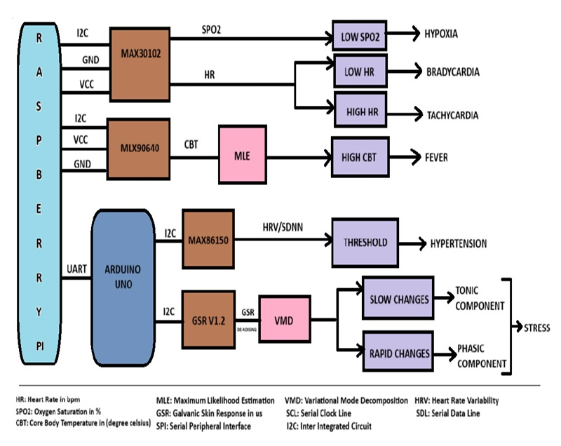
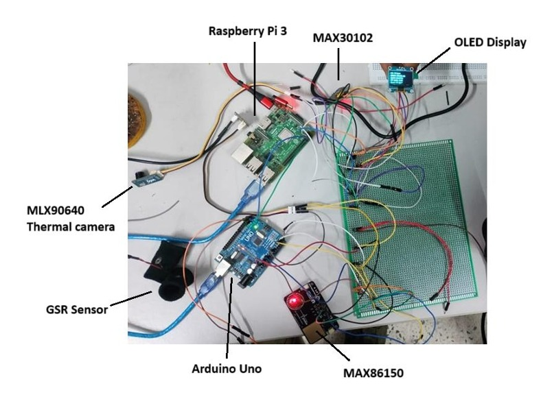
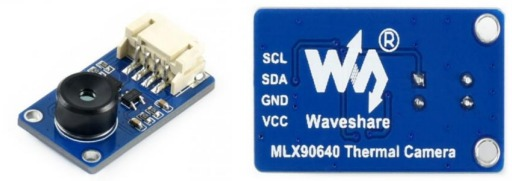
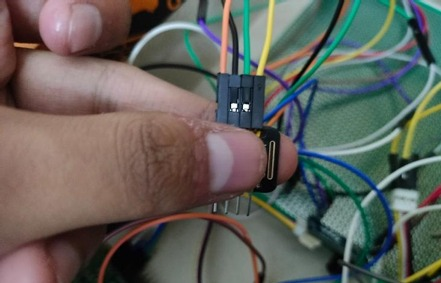
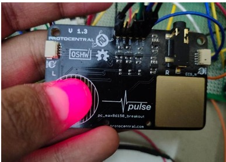
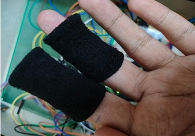

# 🚗 Portable Driver Health Monitoring System using Contact and Non-Contact Sensors

## 👤 Team Members
- **Lakshya Kumar** (Roll No: 220102054)  
- **Lakshit Lavanya Kumar** (Roll No: 220102053)  
- **Supervisor:** Dr. Anirban Dasgupta  
- **Course:** EE-396 Design Lab  
- **Department:** Electronics and Electrical Engineering, IIT Guwahati  

---

## 📌 Objective
Design and implement a **driver health monitoring system** using biomedical sensors. The system monitors:
- Heart Rate (HR)
- Blood Oxygen Saturation (SpO₂)
- Heart Rate Variability (HRV)
- Core Body Temperature (CBT)
- Stress levels

---

## 🧠 Motivation
Most traffic accidents result from driver fatigue or undiagnosed medical issues. Traditional safety systems focus on the environment, but this system emphasizes **real-time human-centered monitoring**, potentially preventing accidents before they happen.

---

## FlowChart

---
## Circuit

---

## 🛠️ Components Used

| Sensor | Parameter Measured | Interface | Platform |
|--------|--------------------|-----------|----------|
| MAX30102 | HR, SpO₂ | I2C | Raspberry Pi |
| MAX86150 | HRV (via PPG + ECG) | I2C | Arduino |
| MLX90640 | Core Body Temp (CBT) | I2C | Raspberry Pi |
| GSR v1.2 | Galvanic Skin Response (Stress) | Analog | Arduino |
| SSD1306 | OLED Display | I2C | Raspberry Pi |
| Arduino Uno | Auxiliary MCU | UART to Pi |
| Raspberry Pi 3 | Central Processing Unit | - | - |

---

## 🔗 Sensor Interfacing Summary

- **Raspberry Pi 3**: Central controller.
  - I2C: MAX30102, MLX90640, SSD1306
  - UART: Connected to Arduino Uno

- **Arduino Uno**: Auxiliary for analog and additional I2C sensors.
  - I2C: MAX86150
  - Analog: GSR
  - UART: Connected to Raspberry Pi 3

---

## 📏 Parameter Estimation Techniques

### 1. **CBT (Core Body Temperature)**
- Estimation via MLX90640 thermal camera.
- Uses **maximum likelihood estimation (MLE)** on temperature frames.
- Output: Mean (μ̂) of Gaussian distribution from thermal frames.

---

### 2. **HR & SpO₂ (via MAX30102)**
- HR: Derived using peak detection on filtered IR PPG signal.
  - `HR = (Sampling_Frequency * 60) / Avg_Peak_Interval`
- SpO₂: Computed from Red/IR AC-DC signal ratio:
  - `SpO₂ = -45.060*(R^2) + 30.054*R + 94.845`
  

---

### 3. **HRV / Hypertension Risk (via MAX86150)**
- Peaks extracted using ensemble methods.
- HRV estimated using:
  - `SDNN = stddev(RR intervals)`
- Low HRV linked with hypertension risk.

### 4. **Stress (via GSR)**
- Measures skin conductance via analog voltage.
- Signal is decomposed using **Variational Mode Decomposition (VMD)** into tonic and phasic components.

---

## 🧪 Results
- All parameters were tested under simulated driving conditions.
- Achieved consistent readings across HR, SpO₂, CBT, HRV, and GSR.
- Displayed outputs live on OLED.
- Stable UART communication ensured real-time data transfer between Arduino and Pi.

---

## 🧾 Codebase Structure

- `arduino_code/`: Reads MAX86150 and GSR data; sends via UART.
- `raspberry_code/main.py`: Central pipeline — reads all sensor data, performs estimation, displays results.
- `raspberry_code/modules/`: Contains helper scripts for CBT estimation, HR/SpO₂ calculations, SDNN analysis, and GSR processing.

---

## ⚠️ Known Limitations

- **Thermal sensor** readings are sensitive to ambient conditions.
- **Motion artifacts** degrade PPG signal quality (MAX30102/86150).
- **Loose sensor placement** affects contact-based readings.
- **GSR variability** due to external humidity/temperature.
- SDNN provides **only an indicative risk**, not a diagnosis.

---

## 📈 Future Scope

- Integrate AI-based anomaly detection.
- Add camera-based facial fatigue monitoring.
- Miniaturize the hardware for in-vehicle deployment.

---

## 📷 Sample Outputs

### PPG under stress vs non-stress:
*(Graphs included in original report)*

---

## 📄 License

This project was developed as part of EE396 at IIT Guwahati and is intended for academic use.

